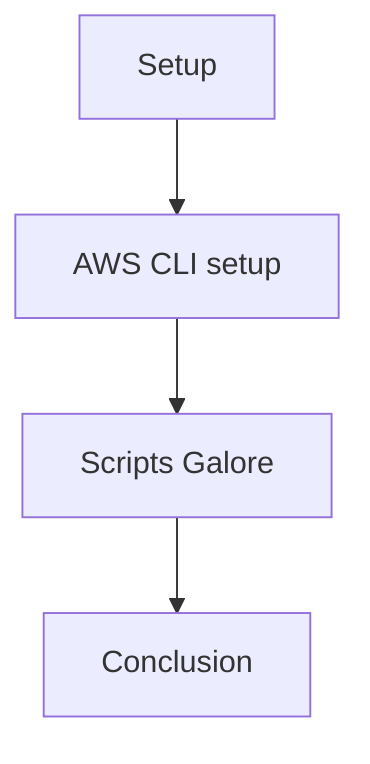

# minecraft-terraform-tutorial

## Diagram


## Setup
This tutorial uses already some established resources (security group, key pair, and VPC). If you do not understand what those are or how to get them read up to the **Server Setup** section in [this](manual_tutorial/minecraft-server-tutorial.md) tutorial.

On top of having a security group, key pair, and VPC set up you will also need some software on your local device.

* [Terraform](https://developer.hashicorp.com/terraform/tutorials/aws-get-started/install-cli) Follow up to the **Quick Start Tutorial** to install. 

* [AWS CLI](https://docs.aws.amazon.com/cli/latest/userguide/getting-started-install.html)

* [ansible](https://docs.ansible.com/ansible/latest/installation_guide/intro_installation.html)

### AWS CLI setup
1. Create a file ~/.aws/credentials
2. Get your AWS credentials.(aws_access_key, aws_secret_access_key, aws_session_token).
3. Paste them into the file it should look something like this:
```text
[defaut]   
aws_access_key_id=ABUNCHOFCHARACTERS
aws_secret_access_key=ABUNCHMORECHARACTERS
aws_session_token=AMETRICF**KTONOFCHARACTERSTHATWILLTAKEUPALOTOFSPACE
```
4. Save the file.

   

## Scripts Galore
There are a few scripts that will need to be run in order to get the minecraft server up and running.

1. Go to the .aws directory we created and git pull this repo into it (I am going to assume you know how to use git).
2. Go into the newly created directory.
3. examine the *main.tf* file and ensure that all of the commented fields are how you desire them.

We will now use terraform to create our server. First run:

    terraform init 

    terraform apply

Running those commands will take a second but will create the machine that the MC server is going to run on. 

4. When the process is finished it should output an IP address, confirm that it is also written inside of the *ip_address.txt* file (if it is not write the ip into the file yourself).
5. Now run the *generate-inventory.sh* script, ensure that the *inventory* file starts with the IP inside of your *ip_address.txt* file.
6. Examine the *minecraft-docker.yml* file and make sure that you are ok with it's settings.

We will now use ansible to automate server configuration. Run: 

    anisble-playbook -i inventory minecraft_docker.yml

## Conclusion

Your server should now be up and running with a service in place to restart it properly when needed. 

To connect to your server simply go into minecraft and connect to the server using direct connect.

For the ip it will be something similar to this based on your region and IP assigned by AWS where the X's are your IP address.

    ec2-XXX-XXX-XXX-XXX.us-west-2.compute.amazonaws.com

**Note:** If you changed the region of the server the IP you connect to should reflect that.

## Resources/Sources used
[1] Chatgpt, https://openai.com/chatgpt/ (accessed Jun. 8, 2024).
